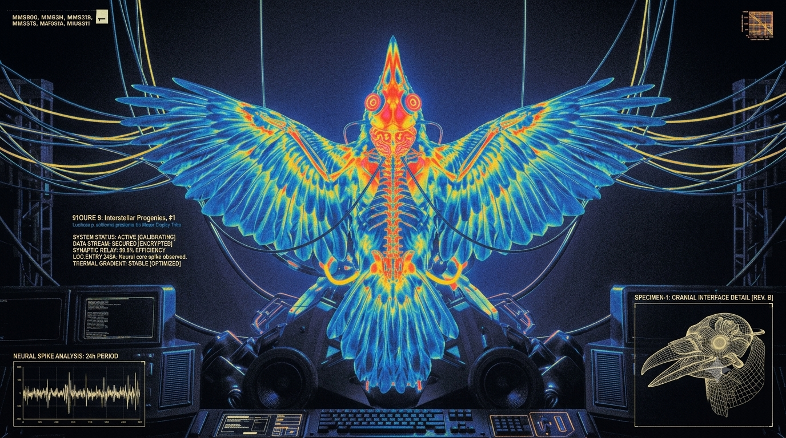

<p align="center">
  
</p>

# Stellar Raven

Remote MCP server (Cloudflare Workers) exposing two tools — `search` and `execute` — over a
unified catalog of Stellar services. `execute` runs LLM-authored JS in a Dynamic Worker isolate
with no network; all service traffic goes through host-side adapters. Design: [PLAN.md](./PLAN.md);
end-to-end mechanics (auth → search scoring → sandbox → envelope → skills): [ARCHITECTURE.md](./ARCHITECTURE.md).

Deployed as the Cloudflare worker `stellar-raven-codemode` at https://raven.stellar.buzz — the
worker/service name deliberately keeps the `codemode` suffix even though the repo is `stellar-raven`.

## Quickstart

```
Server URL:   https://raven.stellar.buzz        (live since 2026-07-02; alias: https://agents.stellar.buzz still works)
MCP endpoint: POST https://raven.stellar.buzz/mcp   (streamable HTTP)  # or https://agents.stellar.buzz/mcp
Health:       GET  /health
```

Local dev: `npm ci`, populate `.dev.vars` (see “Secrets” below), then `npm run dev` and point a
client at `http://localhost:8787/mcp`. Note: `wrangler dev` does NOT hot-reload `.dev.vars`
edits — restart it after changing them.

## Auth

Everything at `/mcp` requires WorkOS-backed OAuth, with two deliberate bypasses
(design: `research/auth-workos.md`; wiring: `src/server.ts`, `src/auth/`).

**OAuth connector flow (Claude, Cursor, any MCP client).** Just add the server URL — no
pre-shared credentials. The Worker is its own OAuth 2.1 authorization server via
`@cloudflare/workers-oauth-provider`: clients discover it through
`/.well-known/oauth-protected-resource/mcp` (advertised in the 401 `WWW-Authenticate` header)
and `/.well-known/oauth-authorization-server` (also aliased at
`/.well-known/openid-configuration` for clients that only probe OIDC discovery),
register dynamically at `/register` (or via CIMD URL client_ids), and run
S256-PKCE authorization at `/authorize` → `/token`. The `/authorize` consent page hands the human
to WorkOS AuthKit for sign-in; WorkOS tokens are dropped after the code exchange — the server
mints its own opaque tokens (access 90 d, client registration 365 d) keyed to a hashed subject.
Single scope: `mcp`.

**Admin token bypass.** Requests carrying the `MCP_ADMIN_TOKEN` secret skip OAuth entirely
(for evals/ops tooling):

```
Authorization: Bearer <MCP_ADMIN_TOKEN>     # or:  X-MCP-Admin-Token: <MCP_ADMIN_TOKEN>
```

Compared as SHA-256 digests with a timing-safe check; if the secret is unset, the bypass is off.

**Local dev bypass.** `DEV_ALLOW_UNAUTHENTICATED=true` in `.dev.vars` sends `/mcp` straight to
the handler with no auth. Never deploy this var.

### Secrets

Local values go in `.dev.vars` (gitignored); deployed values via `wrangler secret put`:

| Name | Purpose |
|---|---|
| `WORKOS_CLIENT_ID` / `WORKOS_API_KEY` | WorkOS AuthKit app (API key doubles as the `client_secret` in the code exchange) |
| `MCP_SERVER_SECRET` | pepper for subject hashing — never store raw WorkOS user ids |
| `MCP_ADMIN_TOKEN` | admin bypass token (optional; unset = OAuth only) |
| `LUMENLOOP_API_KEY`, `ALGOLIA_APPLICATION_ID`, `ALGOLIA_API_KEY` | upstream service adapters |

Token/client/grant state lives in the `OAUTH_KV` namespace (bound in `wrangler.jsonc`).

## Development

```
npm run typecheck  # tsc
npm test           # vitest (offline; auth suite in test/auth.test.ts)
npm run typegen    # regenerate env.d.ts after wrangler.jsonc/.dev.vars changes
```

## Observability

Structured JSON events (`src/observability.ts`) land in Workers Logs; traces are enabled with a
custom `codemode.execute` span around each sandbox run (the Worker Loader isolate is not
auto-instrumented). Both are queryable in the dash (Workers & Pages → Observability) or via the
telemetry query API. Survey of the whole surface — pricing, query API, OTel export, GraphQL
metrics: `research/observability-cloudflare.md`.
